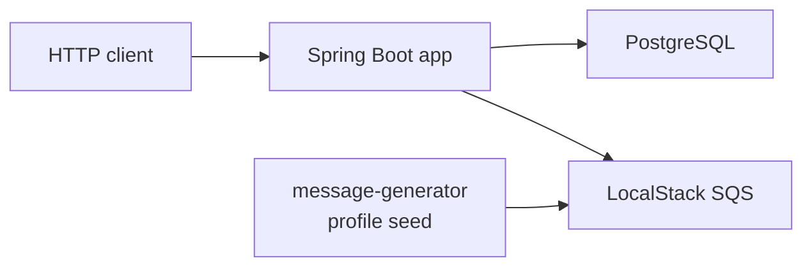

# Account Movement Authorizer

Aplicação de autorização de movimentações de conta, desenvolvida em Kotlin/Spring Boot para consumir eventos de abertura de conta, autorizar transações financeiras e registrar rastreabilidade das decisões.

## Visão geral

O serviço oferece:

- Consumo de mensagens SQS de contas abertas.
- Persistência idempotente de contas com saldo inicial zero.
- API `POST /transactions/{transactionId}` para autorização de `CREDIT` e `DEBIT`.
- Idempotência por `transactionId`.
- Lock pessimista para consistência de saldo em concorrência.
- Registro de transações `SUCCEEDED` e `FAILED`.
- Observabilidade básica com Actuator, métricas e Prometheus.
- Ambiente local com PostgreSQL, LocalStack, aplicação containerizada e gerador de mensagens.

## Stack

- Kotlin
- Spring Boot 3
- Java 21
- Gradle Kotlin DSL
- Spring Web
- Spring Validation
- Spring Data JPA
- PostgreSQL Driver
- Flyway
- Spring Boot Actuator
- Micrometer Prometheus
- springdoc-openapi
- AWS SDK SQS v2
- Jackson Kotlin
- JUnit 5
- MockK
- Testcontainers PostgreSQL
- Docker Compose

## Arquitetura

A documentação completa de arquitetura está em [docs/architecture.md](docs/architecture.md).

Resumo local:



Principais fluxos:

- O `message-generator` publica mensagens de abertura de conta na fila `conta-bancaria-criada`.
- A aplicação consome a fila, valida o payload e persiste contas por `accounts.id`.
- A API autoriza transações usando `transactionId` como chave idempotente.
- Alteração de saldo e registro da transação ocorrem na mesma transação de banco.

## Pré-requisitos

- Java 21
- Docker e Docker Compose
- Git
- AWS CLI opcional para inspecionar LocalStack/SQS

No Windows, os comandos Gradle também podem ser executados com `.\gradlew.bat`.

## Executar testes

```bash
./gradlew clean test
```

Os testes de integração usam Testcontainers para PostgreSQL.

## Executar local via Gradle

Suba a infraestrutura:

```bash
docker compose up -d postgres localstack
```

Popule a fila local com contas sintéticas:

```bash
docker compose --profile seed up message-generator
```

Inicie a aplicação com profile `local`:

```bash
SPRING_PROFILES_ACTIVE=local ./gradlew bootRun
```

PowerShell:

```powershell
$env:SPRING_PROFILES_ACTIVE = "local"
.\gradlew.bat bootRun
```

Fora do container, o profile `local` usa:

- PostgreSQL em `localhost:5432`
- LocalStack em `http://localhost:4566`
- fila `http://localhost:4566/000000000000/conta-bancaria-criada`
- credenciais locais `test/test`

## Executar via Docker Compose

Build da imagem:

```bash
docker compose build app
```

Subir PostgreSQL, LocalStack e aplicação:

```bash
docker compose up -d postgres localstack app
```

Popular a fila:

```bash
docker compose --profile seed up message-generator
```

Dentro da rede Docker, a aplicação usa:

- PostgreSQL em `postgres:5432`
- LocalStack em `http://localstack:4566`
- fila `http://localstack:4566/000000000000/conta-bancaria-criada`
- profile `local`
- credenciais `test/test` somente para LocalStack

## Testar autorização

Depois de popular a fila, pegue uma conta persistida:

```bash
docker compose exec -T postgres psql -U account_authorizer -d account_authorizer -c "select id, balance_amount, balance_currency, status from accounts limit 5;"
```

Exemplo de crédito:

```bash
curl -X POST http://localhost:8080/transactions/8e8ae808-b154-48b5-9f3e-553935cc4543 \
  -H "Content-Type: application/json" \
  -d '{
    "account": { "id": "SUBSTITUA_PELO_ACCOUNT_ID" },
    "transaction": {
      "type": "CREDIT",
      "amount": { "value": 97.07, "currency": "BRL" }
    }
  }'
```

Exemplo de débito:

```bash
curl -X POST http://localhost:8080/transactions/8ab03f98-35e3-4bc1-a534-c2a8377da675 \
  -H "Content-Type: application/json" \
  -d '{
    "account": { "id": "SUBSTITUA_PELO_ACCOUNT_ID" },
    "transaction": {
      "type": "DEBIT",
      "amount": { "value": 25.00, "currency": "BRL" }
    }
  }'
```

Há uma coleção de exemplos em [docs/requests/account-movement-authorizer.http](docs/requests/account-movement-authorizer.http), incluindo sucesso, saldo insuficiente, conta inexistente, idempotência, conflito idempotente e payload inválido.

## Consultar PostgreSQL

Contas:

```bash
docker compose exec -T postgres psql -U account_authorizer -d account_authorizer -c "select id, owner_id, status, balance_amount, balance_currency from accounts limit 10;"
```

Transações:

```bash
docker compose exec -T postgres psql -U account_authorizer -d account_authorizer -c "select id, account_id, type, amount_value, amount_currency, status, failure_reason, balance_before_amount, balance_after_amount from transactions order by requested_at desc limit 10;"
```

## Swagger e OpenAPI

- Swagger UI: [http://localhost:8080/swagger-ui/index.html](http://localhost:8080/swagger-ui/index.html)
- OpenAPI JSON: [http://localhost:8080/v3/api-docs](http://localhost:8080/v3/api-docs)

O endpoint `POST /transactions/{transactionId}` está documentado com descrição, exemplos básicos e respostas `200`, `400` e `409`.

## Actuator e métricas

Endpoints expostos:

- [http://localhost:8080/actuator/health](http://localhost:8080/actuator/health)
- [http://localhost:8080/actuator/info](http://localhost:8080/actuator/info)
- [http://localhost:8080/actuator/metrics](http://localhost:8080/actuator/metrics)
- [http://localhost:8080/actuator/prometheus](http://localhost:8080/actuator/prometheus)

Endpoints sensíveis como `env`, `beans`, `heapdump` e `threaddump` não são expostos.

Métricas customizadas, exemplos de Prometheus e smoke/load local leve estão em [docs/operational-insights.md](docs/operational-insights.md).

Dashboard opcional com Prometheus/Grafana: veja [docs/observability-dashboard.md](docs/observability-dashboard.md).

Validação E2E/smoke automatizada: veja [docs/e2e-smoke-validation.md](docs/e2e-smoke-validation.md).

## Regras principais

- `CREDIT` soma o valor ao saldo atual.
- `DEBIT` subtrai o valor quando há saldo suficiente.
- `DEBIT` com saldo insuficiente registra `FAILED` com `INSUFFICIENT_FUNDS` e não altera saldo.
- Conta inexistente registra `FAILED` com `ACCOUNT_NOT_FOUND`.
- Conta diferente de `ENABLED` registra `FAILED` com `ACCOUNT_DISABLED`.
- Apenas `BRL` é aceito nesta versão.
- `amount.value` deve ser maior que zero e ter no máximo duas casas decimais.
- Reenvio do mesmo `transactionId` com payload idêntico retorna o resultado já persistido.
- Reenvio do mesmo `transactionId` com payload diferente retorna `409 Conflict`.

## Decisões técnicas

ADRs:

- [ADR 0001 - Stack Kotlin, Spring Boot e PostgreSQL](docs/adr/0001-stack-kotlin-spring-postgresql.md)
- [ADR 0002 - Valores monetários em centavos](docs/adr/0002-money-in-cents.md)
- [ADR 0003 - Idempotência por transactionId](docs/adr/0003-transaction-idempotency.md)
- [ADR 0004 - Lock pessimista para saldo](docs/adr/0004-pessimistic-locking.md)
- [ADR 0005 - SQS standard e idempotência na abertura de contas](docs/adr/0005-sqs-standard-account-opening.md)
- [ADR 0006 - Docker Compose e LocalStack no ambiente local](docs/adr/0006-local-compose-localstack.md)

Outras decisões:

- Flyway gerencia schema e Hibernate valida com `ddl-auto: validate`.
- `transactions.account_id` é referência lógica para permitir auditoria de recusas por conta inexistente.
- Logs usam formato simples key-value para busca por `transactionId`, `accountId`, `messageId`, `status` e `failureReason`.

## Trade-offs

- Lock pessimista reduz risco financeiro, mas pode limitar vazão em contas muito concorridas.
- SQS standard exige idempotência porque mensagens podem ser duplicadas.
- LocalStack aumenta fidelidade local sem depender de AWS real, mas não substitui validação em ambiente cloud.
- Logs estruturados JSON não foram adicionados para evitar stack extra nesta entrega.
- Prometheus foi adicionado como dependência pequena para expor métricas em formato amplamente suportado.
- Valores monetários usam `Long` em centavos; limites de valor máximo por produto seriam uma evolução para produção.

## Pipeline e deploy

O workflow simples está em [.github/workflows/ci.yml](.github/workflows/ci.yml) e executa `./gradlew clean test` em pull requests e pushes para `main` ou `master`.

A proposta de pipeline e deploy está em [docs/pipeline-and-deploy.md](docs/pipeline-and-deploy.md), cobrindo build, testes, imagem, staging, canary/blue-green e rollback.

## Próximos passos

- Adicionar DLQ e política de redrive para a fila de abertura de contas.
- Criar dashboards e alarmes para métricas técnicas e de negócio.
- Adicionar autenticação/autorização na borda.
- Avaliar tracing distribuído com OpenTelemetry.
- Executar testes de carga focados em contas com alta concorrência.
- Formalizar deploy real em ambiente cloud.

## O que não foi implementado e por que

- Extrato: fora do escopo do desafio atual.
- Consulta de saldo: fora do escopo para manter a API focada em autorização.
- Autenticação/autorização: seria responsabilidade de borda ou fase dedicada de segurança.
- DLQ real: documentada como evolução porque exige decisão de infraestrutura.
- Novas tabelas/migrations: evitadas para não alterar o modelo validado nas fases anteriores.
- Publicação de imagem e deploy real: documentados, mas não executados para não depender de secrets ou registry externo.

## Segurança local

Não há secrets reais no repositório. As credenciais `test/test` aparecem apenas para uso local com LocalStack.

O PDF do desafio não faz parte do repositório.
