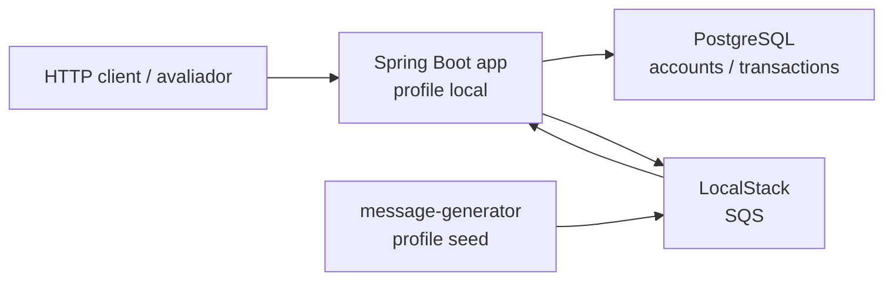

# Arquitetura

## Arquitetura local

## Fluxo de abertura de conta via SQS

## Fluxo de autorizacao de transacao

## Proposta de arquitetura cloud publica

## Observabilidade e operacao

- Logs em formato simples key-value para permitir busca por `transactionId`, `accountId`, `messageId`, `status` e `failureReason`.
- Actuator exposto somente com endpoints operacionais seguros: health, info, metrics e prometheus.
- Metricas Prometheus podem ser coletadas por Prometheus gerenciado, agente OpenTelemetry ou CloudWatch Agent, conforme a plataforma escolhida.

## Escalabilidade

- A API pode escalar horizontalmente porque a consistencia de saldo depende do lock transacional no PostgreSQL.
- O consumidor SQS pode escalar horizontalmente, desde que a idempotencia por `accounts.id` seja mantida.
- Contas muito quentes podem gerar contencao no banco; particionamento funcional ou filas por chave seriam proximos passos se esse gargalo aparecer.
